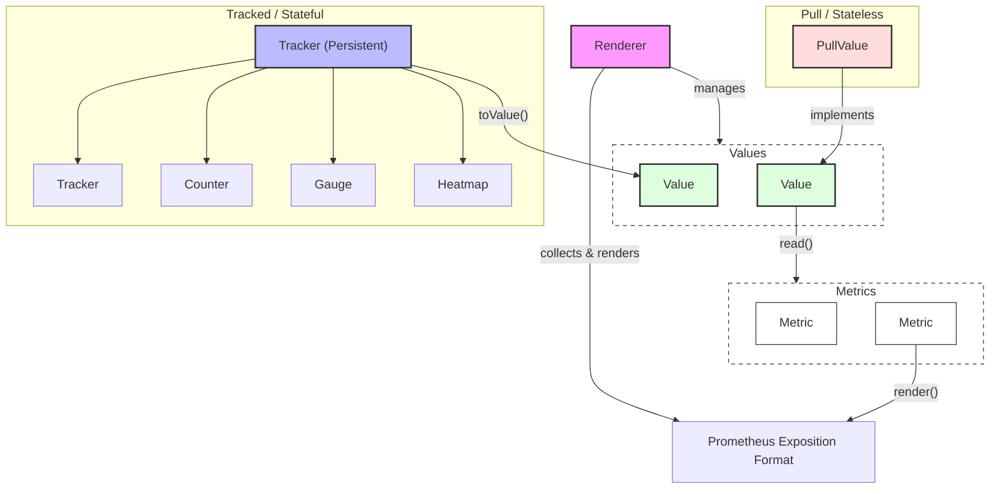

[](https://mops.one/promtracker)
[](https://mops.one/promtracker/docs)

# Motoko value tracker for prometheus

## Overview

The library provides a two-layer approach to metric tracking:

1.  **Tracker**: A persistent state object that holds counters, gauges, and heatmaps. It is designed to be stored in a variable within a `persistent actor` (using Enhanced Orthogonal Persistence) so that its values survive canister upgrades.
2.  **Renderer**: A transient class that wraps around a `Tracker` (or multiple trackers/values) and manages global labels (like `canister="id"`). The `Renderer` is re-initialized after each upgrade.

### Component relationship



The `mo:promtracker/mixins/http` mixin exports the metrics in the Prometheus exposition format via HTTP.
From the endpoint, normally `/metrics`, the metrics can be scraped by a Prometheus scraper.

The list of tracked metrics is initially empty.
The canister has to register the values it wants to export with the tracker or renderer.
Registration of values is a one-time action and is most commonly done in the top-level actor code, i.e. during canister installation.
However, it is also possible to register values dynamically at a later time.

The canister code then updates the registered values at runtime during the specific event that corresponds to the value.
The two main such value types are `Counter` and `Gauge`.

A `Counter` is normally an ever-increasing counter such as the number of total requests received.

A `Gauge` captures a frequently changing, fluctuating value such as the size of the last request, time between last two events, etc.
A gauge automatically tracks the high and low watermarks between scraping events plus a histogram in which all values are captured.

There is another value type which is not explicitly updated by canister code, the `PullValue`.
The value is calculated on the fly ("pulled") when the `/metrics` endpoint is being scraped.

For example, the canister's system state such as cycle balance and memory size can be exposed through `PullValue`s.
A `PullValue` means they are read at scraping time and returned.

`Tracker` state (including its counters and gauges) can be persisted across canister upgrades by using a non-transient variable in a `persistent actor`.

## Links

The package is published on [MOPS](https://mops.one/promtracker) and [GitHub](https://github.com/research-ag/promtracker).

The API documentation can be found [here](https://mops.one/promtracker/docs/lib) on Mops.

For updates, help, questions, feedback and other requests related to this package join us on:

- [OpenChat group](https://oc.app/2zyqk-iqaaa-aaaar-anmra-cai)
- [Twitter](https://twitter.com/mr_research_ag)
- [Dfinity forum](https://forum.dfinity.org/)

## Usage

### Executable examples

The `examples/` directory contains executable examples.
For instructions how to run them see: [examples/README.md](examples/README.md).

### Minimal code

The minimal code to use `promtracker` is:

```motoko
import PT "mo:promtracker";
import Http "mo:promtracker/mixins/http";

persistent actor Main {
  let pt = PT.Tracker.new();
  transient let renderer = PT.Renderer();

  renderer.addValue(pt.toValue());
  renderer.addCanisterLabel(Main);
  renderer.addValue(PT.allSystemMetrics);

  include Http(renderer.renderExposition, "/metrics");
};

```

The `renderer.addValue(PT.allSystemMetrics)` command registers
a default set of system metrics including cycle balance
and memory stats.
Without this command the metrics would be empty without further code.
The default system metrics are all `PullValue`s.

Metrics render like this:

```text
cycles_balance{canister="tl4x7"} 1497180100444 1770400321653
canister_version{canister="tl4x7"} 2 1770400321653
rts_memory_size{canister="tl4x7"} 5308416 1770400321653
rts_heap_size{canister="tl4x7"} 5274976 1770400321653
rts_total_allocation{canister="tl4x7"} 5275208 1770400321653
rts_reclaimed{canister="tl4x7"} 0 1770400321653
rts_max_live_size{canister="tl4x7"} 0 1770400321653
rts_max_stack_size{canister="tl4x7"} 4194304 1770400321653
rts_callback_table_count{canister="tl4x7"} 0 1770400321653
rts_callback_table_size{canister="tl4x7"} 0 1770400321653
rts_mutator_instructions{canister="tl4x7"} 0 1770400321653
rts_collector_instructions{canister="tl4x7"} 0 1770400321653
rts_upgrade_instructions{canister="tl4x7"} 7320 1770400321653
rts_stable_memory_size{canister="tl4x7"} 0 1770400321653
rts_logical_stable_memory_size{canister="tl4x7"} 0 1770400321653
```

### PullValue

`PullValue`s are metrics that are calculated on the fly when the `/metrics` endpoint is being scraped.

```motoko
import PT "mo:promtracker";
import Prim "mo:prim";

persistent actor Main {
  let pt = PT.Tracker.new();
  transient let renderer = PT.Renderer();
  renderer.addValue(pt.toValue());

  // A PullValue is added to the renderer
  renderer.addValue(PT.newValue("cycles", [], func() = Prim.cyclesBalance()));
};

```

Here, the third argument can be any function `() -> Nat` that returns the current value.

Metrics render like this:

```text
cycles{canister="tl4x7"} 1497180100444 1770400321653
```

### Labels

Prometheus labels can be added at different levels:

1.  **Global labels**: Added to the `Renderer`. These are prepended to every metric rendered by that renderer.
2.  **Per-metric labels**: Added when creating a counter, gauge, or heatmap.

```motoko
// Global label on renderer
renderer.addLabel("env", "prod");

// Per-metric labels on tracker (using an array of tuples)
let ctr = pt.newCounter("my_counter", [("id", "1"), ("tier", "api")]);

// Per-metric labels on a pull value
renderer.addValue(PT.newValue("my_pull", [("type", "test")], func() = 42));

```

Metrics render like this:

```text
my_counter{canister="tl4x7",env="prod",id="1",tier="api"} 0 1770400321653
my_pull{canister="tl4x7",env="prod",type="test"} 42 1770400321653
```

### Persistence

When using a `persistent actor` (Enhanced Orthogonal Persistence), state stored in non-transient variables persists across upgrades.

- The `Tracker` and metrics created from it (counters, gauges, heatmaps) should be stored in non-transient variables to persist their values.
- The `Renderer` is transient and should be re-initialized in the actor body. Since adding values and labels to it is cheap, there is no downside to this.

```motoko
persistent actor Main {
  // PERSISTENT: survive upgrades
  let pt = PT.Tracker.new();
  let heartbeats = pt.newCounter("heartbeats_total", []);

  // TRANSIENT: re-initialized on upgrade
  transient let renderer = PT.Renderer();
  renderer.addValue(pt.toValue());
  renderer.addCanisterLabel(Main);
  renderer.addValue(PT.allSystemMetrics);
};

```

### Counter

A `Counter` is an ever-increasing value.

```motoko
let requests = pt.newCounter("requests_total", [("method", "get")]);

public func handle_get() {
  requests.add(1);
};

```

Metrics render like this:

```text
requests_total{canister="tl4x7",method="get"} 1 1770400321653
```

### Gauge

A `Gauge` represents a value that can go up and down. It automatically tracks high/low watermarks and a histogram of all values seen since the last scrape.

```motoko
// Gauge with buckets: [100, 200, 500]
let processing_time = pt.newGauge("processing_time", [], [100, 200, 500]);

public func process(duration : Nat) {
  processing_time.update(duration);
};

```

Metrics render like this:

```text
processing_time_last{canister="tl4x7"} 150 1770400321653
processing_time_sum{canister="tl4x7"} 150 1770400321653
processing_time_count{canister="tl4x7"} 1 1770400321653
processing_time_bucket{canister="tl4x7",le="100"} 0 1770400321653
processing_time_bucket{canister="tl4x7",le="200"} 1 1770400321653
processing_time_bucket{canister="tl4x7",le="500"} 1 1770400321653
processing_time_bucket{canister="tl4x7",le="+Inf"} 1 1770400321653
```

You can also change the default 302-second hold-down period for watermarks (useful if your scraping interval is not 5 minutes):

```motoko
// Set hold-down to 65 seconds for a 1-minute scraping interval
pt.setHoldDown(65);

```

### Heatmap

A `Heatmap` is a specialized gauge that only tracks a histogram with power-of-2 buckets automatically sized on demand.

```motoko
let latencies = pt.newHeatmap("request_latency", []);

public func record(ms : Nat) {
  latencies.update(ms);
};

```

Metrics render like this:

```text
request_latency_bucket{canister="tl4x7",le="0"} 0 1770400321653
request_latency_bucket{canister="tl4x7",le="1"} 0 1770400321653
request_latency_bucket{canister="tl4x7",le="2"} 0 1770400321653
request_latency_bucket{canister="tl4x7",le="4"} 0 1770400321653
request_latency_bucket{canister="tl4x7",le="8"} 0 1770400321653
request_latency_bucket{canister="tl4x7",le="16"} 0 1770400321653
request_latency_bucket{canister="tl4x7",le="32"} 0 1770400321653
request_latency_bucket{canister="tl4x7",le="64"} 0 1770400321653
request_latency_bucket{canister="tl4x7",le="128"} 1 1770400321653
request_latency_count{canister="tl4x7"} 1 1770400321653
request_latency_sum{canister="tl4x7"} 120 1770400321653
```

### Advanced Usage

#### Bundling

Multiple `Value` objects can be bundled into a single `Value`. This is useful for grouping related metrics and adding common labels to them.

```motoko
let bundled = [
  PT.newValue("metric_a", [], func() = 10),
  PT.newValue("metric_b", [], func() = 20),
].bundle([("group", "example")]);

renderer.addValue(bundled);

```

> **Note:** The dot notation `[...].bundle(...)` requires the `PT` module to be imported. Alternatively, you can use the traditional function call: `PT.bundle([metric1, metric2], labels)`.

#### Nested Trackers

Trackers can be nested to create a hierarchy of metrics. Each nested tracker can have its own set of labels which are prepended to all metrics within it.

```motoko
let apiTracker = pt.newTracker([("module", "api")]);
let userTracker = pt.newTracker([("module", "user")]);

let apiRequests = apiTracker.newCounter("requests_total", []);
let userRegistrations = userTracker.newCounter("registrations_total", []);

```

### Additional HTTP routes

If you want to serve routes other than `/metrics` with your own code, you can define the `http_request` function manually and use the `Http` module's rendering helpers.

```motoko
import PT "mo:promtracker";
import Http "mo:promtracker/Http";

persistent actor Main {
  let pt = PT.Tracker.new();
  transient let renderer = PT.Renderer();
  renderer.addValue(pt.toValue());

  public query func http_request(req : Http.Request) : async Http.Response {
    let ?path = req.url.split(#char '?').next() else return Http.render400();
    switch (req.method, path) {
      case ("GET", "/metrics") {
        Http.renderPlainText(renderer.renderExposition());
      };
      case ("GET", "/hello") {
        Http.renderPlainText("Hello, world!");
      };
      case (_) Http.render400();
    };
  };
};

```

## Agent Skills

If you are using an AI agent, you can install the `promtracker` skill to help it generate correct metrics integration code:

```bash
npx skills add research-ag/promtracker/agent-skills
```

## Default system metrics

The system metrics consist of the following

- `cycles_balance` // Prim.cyclesBalance()
- `canister_version` // Prim.canisterVersion()
- `rts_memory_size` // Prim.rts_memory_size()
- `rts_heap_size` // Prim.rts_heap_size()
- `rts_total_allocation` // Prim.rts_total_allocation()
- `rts_reclaimed` // Prim.rts_reclaimed()
- `rts_max_live_size` // Prim.rts_max_live_size()
- `rts_max_stack_size` // Prim.rts_max_stack_size()
- `rts_callback_table_count` // Prim.rts_callback_table_count()
- `rts_callback_table_size` // Prim.rts_callback_table_size()
- `rts_mutator_instructions` // Prim.rts_mutator_instructions()
- `rts_collector_instructions` // Prim.rts_collector_instructions()
- `rts_upgrade_instructions` // Prim.rts_upgrade_instructions()
- `rts_stable_memory_size` // Prim.rts_stable_memory_size()
- `rts_logical_stable_memory_size` // Prim.rts_logical_stable_memory_size()

## Copyright

MR Research AG, 2023 - 2026

## Authors

Andy Gura (AndyGura) with contributions from Timo Hanke (timohanke)

## License

Apache-2.0

## Development

### Formatting

To format the code, run:

```bash
npx -y prettier --plugin prettier-plugin-motoko --write '**/*.{mo,json,md}'
```
